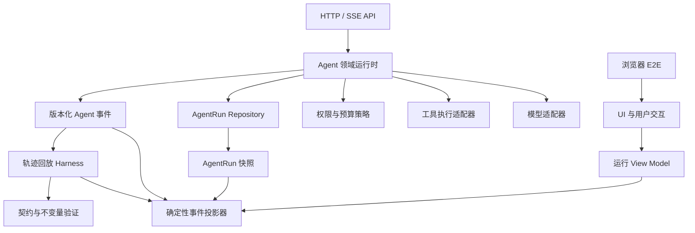

# Code Harness 工程优化指导

> 版本：v1.0（已确认）
>
> 基线：Code v0.5.32，2026-08-02 代码与测试现场
>
> 适用范围：模型请求、AgentRun、工具执行、权限、持久化、恢复、事件投影、前端运行状态、测试与发布门禁
>
> 不替代：具体产品需求、UI 视觉规范、模型采购与渠道准入规范

---

## 一、目的与定位

本文件用于指导 Code 后续 Harness 工程开发。这里的 Harness 不是单指测试脚本，而是模型能力之外承载 Agent 运行的完整工程外壳，包括：

- 模型请求组装、流式响应和错误归一；
- Agent 循环、模型轮、工具轮、上下文压缩和最终回答；
- 工具协议、权限策略、授权等待、副作用执行和恢复；
- AgentRun、Child AgentRun、排队消息与后台任务的生命周期；
- JSONL 会话、运行检查点、事件游标和旧数据兼容；
- 浏览器执行轨迹、计时、折叠、恢复和最终状态投影；
- 单元、契约、集成、轨迹回放、浏览器端到端与发布验证。

Code 当前已经具备稳定的服务端 AgentRun 底座。本方案的目标不是重写现有运行时，也不是为了减少文件行数而机械拆分，而是让已有能力具备明确契约、确定状态、可重放验证和按阶段回退能力。

### 1.1 核心目标

1. 同一份持久事件在首次执行、页面刷新、断线重连和服务重启后产生一致的运行状态与界面结果。
2. 模型轮、工具轮、授权、问卷、压缩、取消和终态都有明确且可验证的状态迁移。
3. 工具副作用在重试和恢复时不会被无意重复执行。
4. 前端不再通过多组松散布尔值猜测运行阶段，而是投影服务端事实和少量明确的本地交互状态。
5. 旧 JSONL、旧 AgentRun 记录、经典前端和当前正式版本均可兼容或单独回退。
6. 后续 Context Envelope、结构化计划、生命周期 Hook 和 Workflow 建立在稳定协议上，而不是继续扩大隐式状态。

### 1.2 非目标

- 不在本计划中改造模型能力或评价模型质量。
- 不以引入 React、Vue、TypeScript 或数据库作为完成条件。
- 不把本地单用户产品提前扩张为多租户远程执行平台。
- 不重写原始会话 JSONL，也不静默迁移用户历史。
- 不为了“架构纯度”一次性替换现有 AgentRun、工具协议或发布链。
- 不先实现允许任意脚本执行的 Workflow DSL。

---

## 二、当前工程基线

### 2.1 已经形成的可靠能力

| 领域 | 当前基线 |
|---|---|
| 服务端运行时 | AgentRun 持续完成模型调用、工具执行、授权等待、问卷和终态收口 |
| 持久化与恢复 | AgentRun 记录、顺序事件、检查点、稳定 `clientRequestId` 和服务重启恢复 |
| 子任务 | 一层 Child AgentRun、受限并发、父任务授权代理、取消传播和用量合并 |
| 工具安全 | `read / plan / accept / bypass` 权限、危险命令拦截、路径边界、SSRF 防护 |
| 上下文 | 手动/自动压缩、上下文超限单次恢复、最近任务与工具组保留 |
| 数据兼容 | JSONL 可见历史保留、旧会话兼容、请求边界投影不改写原始记录 |
| 前端 | bundle 默认入口、经典回退、模块命名空间、执行轨迹、队列与后台任务投影 |
| 验证 | 完整 Python 回归、Node 行为片段、前端构建/新鲜度、EXE 与发布门禁 |

### 2.2 当前主要结构压力

1. `app.js` 仍承担大量应用编排、事件投影、运行期状态和兼容入口；现有模块拆分改善了职责归属，但核心状态变化仍集中。
2. `server.py` 同时承载 HTTP、模型代理、AgentRun、工具执行、持久化、安全策略和多个产品服务，边界主要依赖函数命名和调用约定。
3. AgentRun 持久记录已有版本号，事件也有单调序号，但事件类型、载荷字段、状态迁移和前端处理仍主要由字符串分支形成隐式协议。
4. 前端运行态同时存在会话状态、活跃运行对象、后台检查点、队列、事件游标、计时字段和 DOM 交互快照，容易出现多个事实源。
5. 前端测试对拆分期兼容保护很强，但大量测试依赖源码切片、字符串断言和 Node `eval`；真实浏览器生命周期、SSE 重连和用户交互组合仍主要依赖人工验收。

### 2.3 最近问题揭示的共同根因

近期出现的恢复计时跨越离线时间、工具标题在统述和具体工具之间跳动、展开状态被重绘重置、历史图片 MIME 污染后续请求、压缩上下文与可见历史需要分离等问题，表面上分属不同功能，实质上都涉及：

- 一个事实被服务端记录、前端内存、持久检查点和 DOM 多次表达；
- 状态迁移缺少统一不变量；
- 恢复路径与首次执行路径没有共享同一投影验证；
- 测试验证了单个函数或源码结构，但没有重放完整事件时间线。

因此，下一阶段的最高杠杆不是继续增加状态分支，而是建立事件契约、状态机、轨迹回放和浏览器 E2E 四层护栏。

---

## 三、工程原则

### 3.1 单一事实源

- 服务端 AgentRun 是任务执行事实源。
- 持久事件是任务时间线事实源。
- 会话 JSONL 是用户可见历史事实源，不等同于模型本轮输入。
- 前端状态是服务端事实的投影，加上折叠、焦点、滚动等纯本地交互状态。
- DOM 只能保存短生命周期视觉状态，不能成为任务是否完成、工具是否执行或授权是否生效的事实源。

### 3.2 确定性投影

给定相同的初始快照和事件序列，投影器必须得到相同的：

- 运行状态；
- 模型轮与工具轮状态；
- 计时累计值；
- 消息和执行轨迹结构；
- 待授权、待输入与终态；
- 可持久化检查点。

投影器不得依赖当前墙上时钟之外的隐藏全局变量；涉及时间时必须显式传入 `now` 或使用事件时间。

### 3.3 副作用与投影分离

- reducer/投影器只计算状态，不发网络请求、不操作文件、不启动命令、不写 JSONL。
- 工具执行适配器负责副作用，并返回可持久化回执。
- 恢复流程先依据回执判断是否已经执行，再决定继续、标记未知或请求用户处理。
- UI 渲染只消费 View Model，不反向改变 AgentRun 执行事实。

### 3.4 增量兼容与可回退

- 新字段先可选，旧字段继续读取。
- 先双读或影子投影，验证一致后再切换唯一入口。
- 每阶段使用独立提交，不把协议、状态机、UI 重绘和新产品功能混在同一提交。
- 旧 JSONL 不迁移；如必须升级 AgentRun 记录，使用读取时归一和新增版本适配器。
- 经典页面至少保留到新 Harness 连续经过一个正式版本和人工回退演练。

### 3.5 按职责拆分，不按行数拆分

一个模块应拥有一类稳定规则和清晰输入输出。只有同时满足以下条件才拆分：

1. 能定义公开接口；
2. 能独立测试；
3. 不依赖调用方私有变量；
4. 回退时不会要求跨多个无关模块恢复；
5. 拆分后减少事实源或隐式耦合，而不是只移动代码。

---

## 四、目标架构



### 4.1 协议层

负责定义并验证：

- AgentRun 快照结构；
- 事件信封和各事件载荷；
- 工具调用、执行回执与授权结构；
- 状态枚举和合法迁移；
- 版本适配与未知字段策略。

协议层不执行工具，不持久化数据，也不渲染界面。

### 4.2 Agent 领域运行时

负责：

- 驱动模型轮和工具轮；
- 应用权限、预算、取消和恢复规则；
- 产生领域事件；
- 根据工具回执决定继续、等待或终止；
- 保证终态不可逆和同一调用幂等。

### 4.3 适配器层

包括模型、工具、文件、命令、网络、图片转换和转写等外部能力。每个适配器需要明确：

- 输入结构；
- 超时和取消；
- 错误分类；
- 是否有副作用；
- 幂等键或执行回执；
- 日志脱敏；
- 重启后恢复策略。

### 4.4 Repository 与会话层

- AgentRun Repository 负责原子读写、版本归一和运行快照。
- 会话 Repository 负责 JSONL、附件和用户可见历史。
- 模型上下文投影独立于会话历史，只在请求边界过滤、转换和压缩。
- 不允许 UI 为了修复模型请求而删除用户可见历史。

### 4.5 前端投影层

前端按三类状态分开：

1. **领域状态**：运行、模型轮、工具轮、授权、问卷、压缩、终态，由事件投影产生。
2. **持久 UI 状态**：会话选择、配置、语言、主题等，由现有配置和会话状态管理。
3. **瞬时交互状态**：折叠、焦点、滚动、悬停等，仅在当前页面存在。

不得用瞬时交互状态判断领域状态；不得把领域状态仅保存在 DOM 中。

### 4.6 验证层

验证层由契约测试、集成测试、轨迹回放和浏览器 E2E 共同组成。完整测试数量不是唯一目标，关键是每种运行状态和跨层时序至少有一条可重复证据。

---

## 五、事件契约与状态机

### 5.1 推荐事件信封

新事件契约建议采用可选新增字段，先与现有事件并存：

```json
{
  "schemaVersion": 1,
  "eventId": "evt_...",
  "seq": 17,
  "runId": "agent_...",
  "sessionId": "session_...",
  "turnId": "turn_...",
  "stageId": "stage_...",
  "type": "tool.completed",
  "createdAt": "2026-08-02T18:00:00+08:00",
  "payload": {}
}
```

约束：

- `schemaVersion` 明确载荷版本，不与 AgentRun 持久记录版本混用。
- `eventId` 全局稳定，`seq` 在单个 AgentRun 内单调递增。
- `turnId` 标识一次模型轮，`stageId` 标识一次阶段说明及其工具组。
- `type` 使用稳定命名，不把用户可见文案当作事件类型。
- `payload` 只包含该事件需要的字段，不复制完整请求、Key 或授权头。
- 未识别的新字段必须忽略；未识别的事件类型必须可记录、可诊断，不得导致整个页面崩溃。

事件需要进一步区分耐久性：

- **领域事件**需要持久化，例如运行创建、模型轮开始/结束、工具开始/完成、授权、问卷、压缩和终态。
- **瞬时流事件**默认不逐条长期持久化，例如逐 Token `model.delta`、命令实时输出片段和纯视觉平滑帧；必要时只保存有上限的阶段检查点或最终合并内容。
- replay 夹具可以包含为复现 UI 所需的瞬时流事件，但生产 AgentRun 不应因此无限增长。
- 大块工具输出和模型正文优先使用截断摘要、字符计数或持久内容引用，不能在快照、事件和会话中无界重复保存。

### 5.2 推荐事件族

| 事件族 | 事件示例 |
|---|---|
| Run | `run.created`、`run.resumed`、`run.completed`、`run.failed`、`run.cancelled` |
| Model | `model.pending`、`model.started`、`model.delta`、`model.completed`、`model.recovery` |
| Tool | `tool.requested`、`tool.started`、`tool.authorization_required`、`tool.completed`、`tool.failed` |
| User input | `input.required`、`input.submitted`、`input.cancelled` |
| Context | `context.compaction_started`、`context.compaction_completed`、`context.compaction_failed` |
| Child run | `child.created`、`child.started`、`child.completed`、`child.failed` |
| Diagnostics | `diagnostic.warning`、`diagnostic.compatibility_fallback` |

现有事件无需一次性重命名。第一阶段建立“现有事件名称 → 规范事件类型”的适配表，并用契约测试锁定映射。

### 5.3 Run 状态机

推荐顶层状态：

```text
created
  -> running
  -> waiting_credentials
  -> waiting_authorization
  -> waiting_user_input
  -> running
  -> completed | failed | cancelled
```

不变量：

- 终态不可返回运行态；重复终态事件必须幂等。
- `waiting_*` 必须带稳定等待对象 ID 和恢复目标状态。
- 恢复只能消费当前待处理对象，旧授权或旧问卷答案不得作用于新等待项。
- 取消优先于新一轮模型请求；取消后不得启动新工具副作用。
- AgentRun 的 `updatedAt` 表示最后事实变化，不用于直接推算活跃执行耗时。

### 5.4 模型轮状态机

```text
pending -> streaming -> tool_calls | answer | recovery | failed
recovery -> pending
tool_calls -> tool_execution -> pending
answer -> completed
```

需要明确区分：

- 尚未收到有效内容；
- 正在输出阶段说明；
- 已产生工具调用；
- 工具完成、等待下一轮模型；
- 正在输出最终回答；
- 仅推理、空响应或只承诺未行动的恢复。

工具组标题、顶部状态和“已处理”折叠都应由这些状态决定，不再从消息文字、最后一个 DOM 节点或是否存在工具数量反推。

### 5.5 工具执行状态机

```text
requested
  -> waiting_authorization
  -> running
  -> completed | failed | rejected | cancelled | unknown_after_restart
```

副作用工具必须记录：

- 稳定 `toolCallId`；
- 规范化参数摘要；
- 参数哈希；
- 开始时间与完成时间；
- 授权决定；
- 执行回执；
- 结果摘要和截断信息；
- 重启恢复策略。

相同 `toolCallId` 重放时必须复用已有执行结果。无法确认重启前是否完成的非幂等命令应进入 `unknown_after_restart`，不得自动再执行。

### 5.6 计时语义

统一定义：

- `createdAt`：任务身份创建时间；
- `activeStartedAt`：本次活跃执行开始时间；
- `activeElapsedMs`：此前已经累计的活跃耗时；
- `updatedAt`：最后状态变化时间；
- `completedAt`：终态时间。

刷新或服务重启只累计被产品规则明确标记为活跃的阶段，不能仅根据 `createdAt` 到当前时间的墙上时钟差计算。等待凭据、授权或用户输入是否计入，必须在 H0 冻结当前行为并形成显式阶段表，后续若要改变需单独确认。计时函数必须支持注入固定 `now`，并用轨迹回放验证。

---

## 六、确定性轨迹回放 Harness

### 6.1 目标

从真实或构造的 AgentRun 快照与事件序列中，离线重放前端投影和领域状态，不调用真实模型、不执行工具、不依赖浏览器网络。

### 6.2 轨迹夹具格式

建议放在 `tests/fixtures/agent-traces/`，每条轨迹包含：

```json
{
  "fixtureVersion": 1,
  "name": "multi-tool-with-refresh",
  "initialSnapshot": {},
  "events": [],
  "checkpoints": [
    {
      "afterSeq": 8,
      "expectedState": {},
      "expectedTimeline": []
    }
  ],
  "expectedTerminal": {}
}
```

真实会话转为夹具前必须：

- 删除 Key、Token、Authorization、Cookie 和请求原始凭据；
- 将绝对用户路径替换为固定测试路径；
- 裁剪模型正文和命令输出，只保留复现状态所需内容；
- 记录来源问题和预期行为，不把整份私人会话直接提交到仓库。

### 6.3 首批必备轨迹

1. 纯文本一次完成。
2. 阶段说明后单工具，再输出最终回答。
3. 同阶段多工具，工具组运行中显示当前工具，完成后显示统述。
4. 用户展开工具组，后续事件保持展开，任务终态后外层折叠。
5. `request_user_input` 等待、刷新、提交、继续执行。
6. 文件修改授权接受与拒绝。
7. 命令执行中取消。
8. 服务重启后复用已完成工具回执。
9. 自动上下文压缩后继续同一 AgentRun。
10. 手动压缩保留完整可见历史。
11. 图片历史含不支持 MIME，模型请求降级但 UI 保留原图。
12. 排队消息和显式并行任务同时存在。
13. Child AgentRun 并发完成顺序与模型原调用顺序不同。
14. 上游 401、429、502、超时、空响应和 reasoning-only 恢复。
15. 旧 AgentRun 记录缺少新增字段时恢复。

### 6.4 回放断言

- 每个事件后的顶层状态合法；
- 相同轨迹重复运行得到相同规范化状态哈希；
- 从任意检查点恢复后继续重放，与从头重放终态一致；
- 重复投递同一事件不重复消息、不重复工具、不重复用量；
- 未知事件产生诊断记录，但已知状态保持可用；
- 终态后追加非诊断事件不会改变任务结果；
- 时间相关断言使用固定时钟。

---

## 七、浏览器 E2E 策略

### 7.1 定位

浏览器 E2E 不替代现有 Python 和 Node 测试，只覆盖无法由源码级测试证明的生命周期组合。首批应保持少而稳定，优先 8～12 条关键路径。

### 7.2 测试环境

- 通过隔离临时 `data/` 和项目目录启动测试服务；
- 使用本地假上游按脚本返回 SSE、工具调用、错误和延迟；
- 禁止读取用户真实配置、会话和 Key；
- 开发 bundle 与经典回退页分别至少有一条冒烟；
- Windows 打包版本保留独立人工/自动冒烟，不要求每次单元测试都构建 EXE。

### 7.3 首批 E2E 场景

1. 新会话首次发送立即渲染用户消息和等待状态。
2. 模型阶段说明、工具调用、工具结果和最终回答顺序正确。
3. 工具组展开状态在流式重绘中保持。
4. 页面刷新后恢复运行、计时、事件游标且不重复请求。
5. 问卷和授权在刷新后仍可提交。
6. 停止任务后不再启动下一工具。
7. 自动压缩提示位于正确执行阶段，终态后进入“已处理”。
8. 图片批次、文本顺序、格式降级和旧污染历史续聊。
9. 普通排队与 `/parallel` 路由、取消和恢复。
10. 模型列表刷新失败时保留已有选择并仍可对话。

### 7.4 稳定性原则

- 不使用固定长时间 `sleep`，等待明确 DOM 状态或测试事件。
- 使用稳定 `data-testid`，不依赖用户文案和视觉位置选择器。
- SSE 延迟和事件顺序由假上游确定，不依赖真实网络。
- 失败时保存脱敏截图、控制台、网络摘要和 Agent 轨迹。
- 中文与英文只需在核心文案和布局场景中覆盖，不复制全部流程。

---

## 八、职责拆分路线

职责拆分必须在事件契约和回放测试建立后进行。否则只是把不可验证的隐式状态分散到更多文件。

### 8.1 服务端建议边界

长期建议从 `server.py` 逐步形成以下职责，实际文件名可按现场调整：

| 职责 | 公开接口方向 |
|---|---|
| `agent/protocol` | 事件、快照、工具回执、状态枚举和版本适配 |
| `agent/reducer` | 合法状态迁移和不变量校验 |
| `agent/runtime` | 模型轮、工具轮、取消、恢复和终态编排 |
| `agent/repository` | AgentRun 原子持久化、加载和版本归一 |
| `agent/context` | 模型上下文投影、压缩和 Context Envelope |
| `agent/policy` | 权限、工具预算、轮次、超时和安全策略 |
| `tools/executors` | 文件、命令、网络、图片和其他工具适配器 |
| `http/routes` | 请求解析、响应映射和端点注册 |

第一批只拆纯函数和协议，不移动活跃线程、Condition、进程句柄等高风险对象。运行时拥有权变化必须作为单独高风险阶段处理。

### 8.2 前端建议边界

| 职责 | 公开接口方向 |
|---|---|
| `agent/event-adapter` | 旧事件归一为规范事件 |
| `agent/run-reducer` | 快照与事件生成领域状态 |
| `agent/run-controller` | 创建、订阅、重连、取消与提交输入 |
| `ui/run-view-model` | 领域状态生成时间线和状态文案数据 |
| `ui/run-renderer` | 渲染 View Model，不修改领域状态 |
| `features/queue-controller` | 排队与显式并行任务调度 |
| `services/session-store` | 会话消息、运行检查点和保存链 |

`app.js` 最终应保留页面启动、依赖装配和跨功能协调，不继续直接拥有每种工具、每种事件和每个面板的实现细节。

### 8.3 拆分门禁

每次拆分必须满足：

- 行为测试与轨迹回放前后完全一致；
- 无新增 `window` 临时全局；
- 无跨模块读取私有闭包变量；
- 公开接口冻结或有显式版本；
- bundle、经典回退和 EXE 资源均通过；
- 可由单个提交完整回退。

---

## 九、安全、隐私与副作用治理

### 9.1 凭据边界

- AgentRun 持久记录、事件、轨迹夹具和生命周期 Hook 禁止包含 API Key、workbar Access Token、Authorization、Cookie 或完整请求头。
- 日志脱敏不能只依赖已知 Key 字符串替换；还应按字段白名单序列化公开结构。
- 测试加入多种伪凭据探针，扫描 JSONL、AgentRun、事件、截图说明和错误正文。

### 9.2 工具风险分级

建议为工具定义稳定元数据：

```json
{
  "sideEffect": "none|workspace|system|network|external",
  "idempotency": "safe|receipt_required|never_auto_retry",
  "authorization": "none|policy|always",
  "restartRecovery": "replay_result|resume|mark_unknown"
}
```

权限判断、恢复策略和 UI 提示均读取同一份元数据，不在不同入口重复维护工具名单。

### 9.3 工作区与系统边界

- 文件工具继续强制工作区根和附件根约束。
- 命令工具明确 cwd、超时、取消、输出上限和子进程树处理。
- 系统依赖安装、启动常驻服务、修改 PATH、计划任务和线上配置始终需要专门授权。
- 如果未来提供远程访问或多用户使用，必须先增加进程隔离、资源配额、身份认证和租户数据隔离；当前本地权限模型不能直接视为多租户安全模型。

---

## 十、可观测性与诊断

### 10.1 结构化诊断字段

每次运行至少可关联：

- `sessionId`、`runId`、`turnId`、`stageId`、`toolCallId`；
- 模型、渠道或路由的脱敏标识；
- 创建、首个有效内容、工具开始/完成和终态时间；
- 输入、输出、缓存和压缩前后 Token；
- 恢复次数、重连次数和错误分类；
- 是否使用兼容降级、旧记录适配或图片转换。

### 10.2 用户可见与开发诊断分离

- 用户执行轨迹保持简洁，只显示可理解的阶段、工具、授权和结果。
- 开发诊断可导出脱敏运行摘要和事件时间线，不把内部字段直接堆进聊天消息。
- 错误卡片显示可行动结论；完整堆栈和协议诊断只进入本地日志或显式导出。

### 10.3 建议质量指标

H0 阶段先测量基线，再确定最终阈值。建议持续跟踪：

- 新消息本地首帧渲染延迟；
- 创建 AgentRun 到首个有效模型内容的时间；
- 事件接收到页面投影完成的时间；
- 刷新到恢复正确状态的时间；
- 重复事件、重复上游请求和重复工具副作用计数；
- 未知事件、非法状态迁移和兼容降级计数；
- 100、1000 和长会话事件的回放耗时；
- 会话数量增长后的列表加载与首次发送延迟。

性能优化不得以丢失事件、跳过持久化或破坏恢复为代价。

---

## 十一、分阶段执行计划

### H0：冻结基线与建立事实清单

**目标**：不改变行为，建立后续比较基线。

**H4-6F 补充状态（2026-08-07）**：H4-6F 只参数化 H4-6E 的既有 Playwright 生命周期与刷新流程，为 `/dist/frontend/index.classic.html` direct classic 入口增加两条对等场景。classic 精确标记为 `classic-fallback`、无 bundle ready 且无 fallback query，不属于自动故障降级；它与 bundle 共用同一生产 AgentRun/Runtime/Session/DOM 链、固定 `additional_property` 失败语义及八类领域哈希，刷新后的 AgentRun POST、Runtime POST、chat 与生产工具执行增量均为 0。详见 [`H4-6F direct classic read_file 参数校验失败对等`](harness/h4-6f-direct-classic-read-file-argument-validation-parity.md)。该完成声明不覆盖其他 classic 失败类型、缺 path/JSON parse、文件系统或执行器失败、取消、长输出及上段列出的其他真实浏览器生命周期。

**H4-6G 补充状态（2026-08-07）**：H4-6G 以固定 schema-valid `read_file({"path":"fixture.txt","startLine":2,"endLine":1})` 同时覆盖默认 bundle 与 direct classic；调用通过生产参数校验与既有只读 action/path 白名单，真实进入 `execute_registered_tool → execute_read_file_tool` 并在执行器内部因行范围语义失败。两种入口均闭合单次生产委托/执行、九事件 completed、Runtime `4/0 → 4/3`、Session 五角色、失败 DOM 与完整刷新四项零增量，八类语义哈希完全一致。详见 [`H4-6G read_file 生产执行器行范围失败`](harness/h4-6g-read-file-executor-range-failure.md)。该完成声明不覆盖缺文件、权限、编码、大文件、其他工具执行器、取消、长输出或真实外部副作用 exactly-once。

**H4-6H 补充状态（2026-08-08）**：H4-6H 以固定 `read_file({"path":"h4-missing-fixture.txt"})` 同时覆盖默认 bundle 与 direct classic。该固定相对路径通过生产 schema 与新增的精确测试侧安全分支，拒绝绝对路径、`..`、额外字段和其他 action/path；随后仍调用原 `execute_registered_tool → execute_read_file_tool`，由生产执行器在 project target 的 `exists()/is_file()` 分支抛出“文件不存在”。isolated home 同名不存在只作额外隔离审计，不属于生产失败因果链。两种入口均闭合单次委托/执行、九事件 completed、Runtime `4/0 → 4/3`、Session 五角色、失败 DOM、完整刷新四项零增量及八类对等哈希。详见 [`H4-6H read_file 缺文件生产执行器失败`](harness/h4-6h-read-file-missing-file-executor-failure.md)。该完成声明不覆盖权限、编码、大文件、其他工具执行器、取消、长输出或真实外部副作用 exactly-once。

**H4-6I 补充状态（2026-08-08）**：H4-6I 以固定原始 malformed JSON `{"path":"fixture.txt"` 同时覆盖默认 bundle 与 direct classic。工具参数真实进入生产 `json.loads()` / `parseError` 分支，并在 `execute_registered_tool` 前以 `invalid_tool_arguments`、空 `fieldErrors` 和首次 `failureCount=1` 失败；原始坏 JSON 只在 AgentRun 耐久事实中闭合，Session/UI 则保留规范化的 `read_file` action、无 path 且不保留原文。两种入口均闭合零生产委托/执行、九事件 completed、Runtime `4/0 → 4/3`、Session 五角色、失败 DOM、完整刷新四项零增量及八类对等哈希。详见 [`H4-6I 工具参数 JSON 解析失败生命周期`](harness/h4-6i-tool-arguments-json-parse-error.md)。该完成声明不覆盖缺 path、其他解析错误、执行器失败、取消、长输出或真实外部副作用 exactly-once。

**H4-6J 补充状态（2026-08-08）**：H4-6J 以固定合法 JSON 原始字符串 `"{}"` 同时覆盖默认 bundle 与 direct classic。参数成功解析后命中生产 `read_file` schema 的唯一 `path/required/is required`，在执行器前以 `invalid_tool_arguments`、首次 `failureCount=1` 失败；生产委托/执行与 unsafe 均为 0，但 AgentRun 持久化唯一失败 execution，失败 receipt 进入第二轮且父 Run completed。Session/UI 保留规范化 `read_file` action、无 path，两种入口闭合九事件、Runtime `4/0 → 4/3`、Session 五角色、失败 DOM、完整刷新四项零增量及八类对等哈希。完整矩阵同时以具体旧节点 `Element is not attached` 证明共享 helper 遇到活动态生产重绘；修正仅在当前具体节点仍 open 时点击并始终严格验证可见节点 closed，没有修改生产、超时、retry 或断言强度。详见 [`H4-6J read_file 缺少必填 path 的 schema 失败`](harness/h4-6j-read-file-missing-path-schema-failure.md)。该完成声明不覆盖其他 required 字段、其他工具、真实模型/网络、跨进程 active、取消或发布。

**H4-6K 补充状态（2026-08-08）**：H4-6K 复用 H4-6G 的 schema-valid 只读行范围执行器失败，证明重复身份由工具名与规范 arguments 指纹确定，连续失败还要求 `errorCode` 与规范化错误文本签名一致。前三次相同调用真实执行并得到 `failureCount=1/2/3`，第三次带 `retryLimitReached`；第四个新 toolCallId 的同指纹调用以 `repeated_tool_failure/retryBlocked` 阻断且不进入执行器，第五轮不再携带 tools/tool_choice 并固定终答，父 Run completed。两种入口均闭合 25 事件、五个 Runtime、四对 Session 工具消息、单组四个失败项和刷新四项零增量，九类语义哈希一致。解析/schema 校验早于限流，H4-6E/I/J 的执行前失败不属于本证明。详见 [`H4-6K 相同 read_file 失败限流与强制终答`](harness/h4-6k-identical-read-file-failure-bound-and-forced-final.md)。

**H4-7A 补充状态（2026-08-08）**：H4-7A 为 TIFF 补齐默认 bundle 与 direct classic 的真实浏览器展示闭环。原 TIFF 继续作为唯一持久化附件和模型输入来源，Session MIME 保持 `image/tiff`；模型仍使用既有 PNG 投影。preview POST/GET 只返回内存派生 PNG，不写预览文件或持久化字段。已保存 path 的页面缓存固定为 `pending`、`ready(blob URL)`、`failed`，同页并发、成功、失败与消息重绘均不重复转换，完整刷新后自然重建并允许一次新 GET。两种入口精确为 POST 2、GET 2、总请求 4，失败只显示附件卡片且不阻止发送或模型识别。详见 [`H4-7A TIFF 派生浏览器预览与页面生命周期缓存`](harness/h4-7a-tiff-derived-browser-preview.md)。

**H4-7B 补充状态（2026-08-08）**：H4-7B 修正 detached 用户消息与主任务 turn 所有权不一致：detached 用户仍可见但不再接管主任务完成状态或工具轨迹，主任务及完成后的普通排队任务只在顶部以“用时/Worked for + 时长”各展示一次耗时，对应 assistant 页脚只保留 Token；detached/background/`/parallel` assistant 继续保留自己的单一页脚耗时。后台结果在统一构造入口只规范化一次 `responseTime`，同值镜像到顶层与 `meta._responseTime`，复用既有 Session 序列化恢复，不修改计时算法、Session JSONL 格式、AgentRun、Runtime 或事件协议，也不迁移旧缺失耗时。详见 [`H4-7B 主任务完成计时唯一投影`](harness/h4-7b-primary-completion-elapsed-projection.md)。

**工作项**：

1. 列出现有 AgentRun 状态、事件类型、事件载荷和前端处理函数。
2. 列出现有工具状态、权限、授权和重启恢复策略。
3. 列出前端运行时全部事实源和计时字段。
4. 为现有 AgentRun v1/v2/v3、旧 JSONL 和经典前端准备最小兼容夹具。
5. 从已复现问题生成首批脱敏轨迹，不复制完整真实会话。
6. 记录当前测试耗时、首次发送、刷新恢复和长会话回放基线。

**验收**：

- 清单可由脚本或测试核对，无遗漏的现有事件处理分支；
- 10 条以上关键轨迹夹具通过脱敏检查；
- 不修改 API、JSONL、UI 和运行时行为；
- 完整回归和发布前端门禁通过。

**回退**：删除新增文档、清单、夹具和只读采集脚本即可。

### H1：事件契约与状态不变量

**目标**：把隐式字符串协议变成版本化、可验证契约。

**工作项**：

1. 定义事件信封、事件类型、载荷和未知字段策略。
2. 建立旧事件到规范事件的适配器。
3. 定义 Run、模型轮和工具轮的合法迁移表。
4. 在测试模式下对非法迁移直接失败；正式运行先记录诊断并保持兼容。
5. 增加字段白名单和凭据拒绝测试。

**验收**：

- 每个现有事件类型至少有一条契约测试；
- 旧 AgentRun 记录恢复结果不变；
- 未知新事件不会导致页面或运行时崩溃；
- 终态不可逆、序号单调、事件重复幂等；
- 通过现有完整回归。

**回退**：保留旧事件生产与消费入口；规范适配器可通过功能开关停用。

### H2：确定性 reducer 与影子投影

**目标**：用纯函数计算运行状态，暂不直接替换现有 UI。

**工作项**：

1. 实现服务端领域状态 reducer 或不变量校验器。
2. 实现前端 Run reducer 和规范 View Model。
3. 现有投影继续工作，新 reducer 在影子模式同步计算。
4. 对比终态、工具数量、待授权、计时和时间线结构，记录不一致。
5. 修正差异，直到关键轨迹全部一致。

**验收**：

- 首批轨迹的旧投影与新投影在约定字段上零差异；
- reducer 不访问 DOM、网络、文件或全局时钟；
- 从任意检查点恢复与从头重放终态一致；
- 影子模式关闭后完全回到旧行为。

**回退**：关闭影子计算，不改变持久数据。

### H3：轨迹回放成为回归门禁

**目标**：让时序问题无需真实模型即可稳定复现。

**工作项**：

1. 建立统一 replay runner。
2. 固化关键轨迹和每阶段检查点。
3. 为近期所有跨层时序 Bug 增加回归轨迹。
4. 将回放测试纳入默认完整回归；快速开发可运行定向子集。
5. 失败时输出首个差异事件和状态路径。

**验收**：

- 至少覆盖第六节列出的 15 类轨迹；
- 重复回放状态哈希一致；
- 故意删除或乱序关键事件时测试能准确失败；
- 测试不调用真实模型和真实工具。

**回退**：回放 Harness 独立于生产入口，可单独撤销。

### H4：浏览器 E2E 与新投影切换

**目标**：覆盖 DOM 生命周期并逐步切换唯一投影入口。

**阶段状态（2026-08-07）**：H4-1 已完成隔离浏览器基础设施、自检门禁，以及默认 bundle 纯文本、默认 bundle 单只读工具和 classic fallback 纯文本三条首批冒烟；详见 [`H4-1 浏览器 E2E 基础设施与首批冒烟`](harness/h4-1-browser-e2e-smoke.md)。H4-2 已完成默认 bundle 的同进程模型流式刷新恢复，覆盖首增量前刷新、两段正文后刷新继续追加及刷新后取消，并证明复用同一 AgentRun/Runtime、无第二上游请求、DOM 前缀不回退与取消终态闭合。2026-08-07 的真实 Code Dev 补充验收还修正了模型目录刷新阻塞 AgentRun/Runtime 重附着的启动顺序，并以慢模型目录闸门证明目录未返回时 Runtime GET、前缀追赶和取消已能进行；人工复验为短暂等待后恢复流式，不声称瞬时恢复。详见 [`H4-2 模型流式刷新恢复`](harness/h4-2-model-stream-refresh-recovery.md)。H4-3 已用同一组浏览器流程证明 classic fallback 直接入口的三条刷新路径共用相同生产恢复链，保持同一 AgentRun/Runtime、DOM 前缀和取消终态；详见 [`H4-3 classic fallback 刷新兼容`](harness/h4-3-classic-fallback-refresh.md)。H4-4 已在默认根入口真实 Chromium 中覆盖 bundle 资源加载失败与 bundle 初始化未 ready 两条自动降级，固定 `bundle-load`/`bundle-init` 原因、单次 classic 初始化和降级后纯文本任务闭环；同阶段以严格 pending 命令身份修正 shutdown 响应与正常 exit(0) 的测试 host 竞态，没有弱化非零、signal 或非 shutdown 错误。随后一次独立 stop-time metrics 超时在功能断言通过后触发阶段停止；只读审计未定位明确锁反转，新增白名单阶段 breadcrumb 后一次定向及累计三轮标准 11 例矩阵连续通过，但历史超时仍未复现、根因未定位，5 秒上限、stop-time metrics 和严格清理门禁均未放宽。详见 [`H4-4 自动 bundle 失败降级`](harness/h4-4-automatic-bundle-fallback.md)。H4-5A 已用不同 PID、新随机 loopback 端口和新 origin 建立真实进程 A→B 边界，证明 completed/terminal 纯文本 AgentRun 从同一受控持久化根重载时保持 AgentRun、事件、结果、Session JSONL 和 DOM user/assistant/final 唯一，且 B 不创建 AgentRun、Runtime、chat 或工具执行；旧 Runtime GET 返回 404。详见 [`H4-5A 已完成 AgentRun 的真实跨进程重载`](harness/h4-5a-completed-agentrun-cross-process-reload.md)。H4-5B1 继续复用该真实 A→B 边界，证明含唯一 `read_file` 轨迹的 completed AgentRun 在 B 中保持九事件、工具 result、Session JSONL 与 DOM 唯一，且 B 的 AgentRun POST、Runtime POST、chat 与工具执行增量均为 0；同阶段以 H4 专用 CodeHandler 子类移除生产访问日志与控制 JSONL 共用 stdout 的不安全边界，但不宣称已唯一定位历史控制超时根因。详见 [`H4-5B1 终态工具轨迹跨进程重载`](harness/h4-5b1-terminal-tool-trace-cross-process-reload.md)。H4-6A 已在默认 bundle 中用单个 `read_file` 和两个固定闸门证明工具组手动展开在第二轮正文重绘后保持、前端终态收敛后自动折叠，以及 completed trace/工具组/单项三层在完整刷新后恢复默认折叠且零重执行；详见 [`H4-6A 工具详情生命周期`](harness/h4-6a-tool-detail-lifecycle.md)。H4-6B 将同一参数化流程用于 direct classic fallback，证明相同双闸门、单 `read_file`、身份/九事件/Runtime cursor、三层交互、刷新默认折叠及四项零增量均与 bundle 对等；详见 [`H4-6B direct classic 工具详情对等`](harness/h4-6b-classic-tool-detail-parity.md)。H4-6C 已在默认 bundle 中用同一模型轮两个受限 `read_file("fixture.txt")`、第二工具执行闸门与既有终答闸门证明 T1→T2 声明/执行/结果顺序、11 事件、单组双项重绘保持、完成态折叠、完整刷新默认折叠及四项零增量；该自动证据只覆盖结构稳定性，不声称主观视觉闪烁已解决。详见 [`H4-6C 同轮双工具生命周期与顺序`](harness/h4-6c-same-round-multi-tool-lifecycle.md)。H4-6D 只参数化 H4-6C 的既有 Playwright 流程，为 direct classic 增加同一活动态与刷新态变体，保持 11 事件、T1→T2、单组双项、刷新四项零增量及八类领域哈希与 bundle 完全对等；该入口精确为 `classic-fallback` 且无 bundle ready，不属于自动故障降级。详见 [`H4-6D direct classic 同轮双工具对等`](harness/h4-6d-direct-classic-same-round-multi-tool-parity.md)。H4-6E 以默认 bundle 的固定 `read_file({"path":"fixture.txt","unexpected":true})` 证明生产 schema 在执行器前拒绝唯一 `additional_property`，失败回执进入第二轮且父 Run completed，并闭合失败工具组两相 DOM、完整刷新唯一性与四项零增量；详见 [`H4-6E read_file 参数校验失败`](harness/h4-6e-read-file-argument-validation-failure.md)。H4-6F 将同一流程参数化到 direct classic，保持八类领域哈希、失败 DOM 与刷新四项零增量对等，且不属于自动故障降级；详见 [`H4-6F direct classic read_file 参数校验失败对等`](harness/h4-6f-direct-classic-read-file-argument-validation-parity.md)。H4-6G 再以固定 schema-valid 行范围参数真实进入 `read_file` 生产执行器，并同时闭合 bundle/direct classic 的单次委托/执行、九事件 completed、Runtime `4/0 → 4/3`、Session 五角色、失败 DOM、刷新四项零增量和八类对等哈希；详见 [`H4-6G read_file 生产执行器行范围失败`](harness/h4-6g-read-file-executor-range-failure.md)。active worker 跨进程消费 completed receipt 仍须先确定 explicit/auto resume 与新模型请求语义；异构多工具、缺 path/JSON parse、缺文件/权限/编码/大文件及其他工具执行器失败、重复失败限流、其他 classic 失败类型、取消/长输出详情及问卷/授权、压缩、图片、队列/并行/Child 等真实浏览器生命周期也仍未完成，不得由当前 H4 证据推定通过。

**H4-6H 阶段更新（2026-08-08）**：上段剩余项中的“缺文件执行器失败”现已由 H4-6H 收口；当前真实剩余应读作权限、编码、大文件、其他工具执行器失败及其余已列生命周期。H4-6H 不改变其他产品语义或安全边界，完整证据与限制见 [`H4-6H read_file 缺文件生产执行器失败`](harness/h4-6h-read-file-missing-file-executor-failure.md)。

**H4-6I 阶段更新（2026-08-08）**：上段剩余项中的“JSON parse”现已由 H4-6I 收口；当前执行前参数失败仍保留缺 path 及其他未覆盖解析错误。H4-6I 不改变生产协议、持久化或安全边界，且不把 AgentRun 原始坏 JSON 与 Session/UI 规范化投影混为同一事实；完整证据与限制见 [`H4-6I 工具参数 JSON 解析失败生命周期`](harness/h4-6i-tool-arguments-json-parse-error.md)。

**H4-6J 阶段更新（2026-08-08）**：上段剩余项中的“缺 path”现已由 H4-6J 收口；当前执行前参数失败仍保留其他 required 字段与其他未覆盖解析错误。H4-6J 不改变生产协议、持久化、安全边界或交互语义，完整证据与限制见 [`H4-6J read_file 缺少必填 path 的 schema 失败`](harness/h4-6j-read-file-missing-path-schema-failure.md)。

**H4-6K 阶段更新（2026-08-08）**：上段剩余项中的“重复失败限流”现已由 H4-6K 在固定 schema-valid 只读行范围执行器失败上收口；执行前 schema/parse 失败、不同参数或工具、错误交替及强制终答失败分支仍未覆盖。H4-6K 不改变生产协议、持久化、安全边界或交互语义，完整证据与限制见 [`H4-6K 相同 read_file 失败限流与强制终答`](harness/h4-6k-identical-read-file-failure-bound-and-forced-final.md)。

**H4-7A 阶段更新（2026-08-08）**：上段剩余项中的“图片”现已由 H4-7A 收窄完成 TIFF 派生浏览器预览、失败卡片和页面生命周期请求去重；其他图片格式完整矩阵、TIFF 多页浏览、真实外部模型与发布门禁仍未覆盖。H4-7A 不改变 AgentRun/Runtime、Session JSONL 或模型请求协议，完整证据与限制见 [`H4-7A TIFF 派生浏览器预览与页面生命周期缓存`](harness/h4-7a-tiff-derived-browser-preview.md)。

**H4-7B 阶段更新（2026-08-08）**：上段剩余项中的队列/并行真实 DOM 生命周期现已收窄完成“完成耗时唯一投影”部分：主任务、普通排队任务与 detached/background/`/parallel` 的耗时所有权、页脚/顶部位置、中英文即时切换及完整刷新零新增请求已闭合；队列/并行的其他生命周期、取消、错误和工具组合仍不由本阶段推定通过。完整证据与限制见 [`H4-7B 主任务完成计时唯一投影`](harness/h4-7b-primary-completion-elapsed-projection.md)。

**工作项**：

1. 引入轻量浏览器测试依赖和隔离测试服务。
2. 完成首批 8～12 条关键 E2E。
3. 增加稳定 `data-testid`，不得影响用户视觉。
4. 先在开发端启用新投影，再验证经典回退与正式构建。
5. 连续通过自动与人工验收后，删除旧投影的写入口；兼容读取暂留。

**验收**：

- 默认 bundle 与经典回退冒烟通过；
- 刷新、重连、授权、问卷、压缩、图片和工具折叠无回归；
- 新旧投影切换不修改 JSONL 或 AgentRun 记录；
- 可以单独关闭新投影恢复旧实现。

**回退**：功能开关切回旧投影；保留事件契约和回放测试。

### H5：按职责拆分高耦合编排

**目标**：在已有契约保护下拆分 `server.py` 和 `app.js` 的职责。

**顺序**：

1. 协议、纯函数和版本适配；
2. Repository；
3. 权限与工具元数据；
4. 前端 event adapter、reducer 和 View Model；
5. 运行控制器；
6. 最后才移动线程、Condition、进程和活跃执行拥有权。

**验收**：

- 每次只拆一类职责并独立提交；
- 轨迹状态哈希、浏览器 E2E 和完整回归不变；
- 无新增临时全局和跨模块私有状态读取；
- 单个拆分提交可独立回退。

### H6：可观测性、安全与发布门禁

**目标**：把 Harness 质量变成可持续验证的发布条件。

**工作项**：

1. 脱敏运行摘要和事件轨迹导出。
2. 非法迁移、未知事件、重复副作用和兼容降级统计。
3. 工具风险元数据统一事实源。
4. 凭据探针、路径和命令安全回归扩展。
5. 发布脚本增加契约、回放和关键 E2E 门禁。
6. 正式版与开发版端口、bundle、经典回退和 EXE 冒烟。

**验收**：

- 发布产物不包含测试凭据或私人轨迹；
- 关键 E2E 和 replay 失败会阻断发布；
- 开发诊断关闭后不影响用户界面和性能；
- 完成一次真实回退演练并记录结果。

### H7：在稳定 Harness 上扩展 Agent 能力

只有 H1～H4 稳定后，才按以下顺序推进：

1. Context Envelope；
2. 结构化计划、依赖、预算和验证证据；
3. 只读、脱敏、非阻塞的生命周期 Hook；
4. Cron、Monitor 和 Workflow；
5. 必要时引入 worktree 或其他写冲突隔离。

每项新能力必须先定义事件、持久化、恢复、取消、预算、安全和 replay 夹具，不能只增加 UI 或模型提示词。

---

## 十二、测试矩阵与发布门禁

| 层级 | 负责证明 | 运行频率 |
|---|---|---|
| 单元测试 | 纯函数、格式归一、状态迁移、计时和策略 | 每次相关修改 |
| 契约测试 | 事件、快照、工具回执、版本和未知字段 | 每次 Harness 修改 |
| 集成测试 | 假上游、HTTP、持久化、工具副作用和重启 | 每阶段 |
| Replay | 完整时序、检查点恢复、重复事件和终态一致性 | 默认完整回归 |
| 浏览器 E2E | DOM、流式、刷新、折叠、焦点和交互 | 每阶段及发布前 |
| 构建测试 | bundle、新鲜度、经典回退、EXE 资源 | 每阶段及发布前 |
| 人工验收 | 视觉体感、滚动、焦点、真实浏览器差异 | 仅视觉/时序阶段 |

### 12.1 Harness 修改的最低门禁

任何涉及 AgentRun、事件、工具、恢复、计时或执行轨迹的改动，至少需要：

1. 定向单元/契约测试；
2. 对应 replay 轨迹；
3. 受影响的浏览器 E2E 或明确的人工验收；
4. 完整回归；
5. bundle 构建与新鲜度；
6. JavaScript/Python 语法；
7. `git diff --check`；
8. 旧 AgentRun、旧 JSONL 和经典回退影响说明。

### 12.2 禁止用测试数量代替的证据

- 只断言源码中存在某段字符串；
- 只验证某函数被拆到新文件；
- 只验证最终 DOM，没有验证事件顺序和恢复；
- 只验证首次执行，没有验证刷新和重放；
- 只验证成功路径，没有验证取消、拒绝和未知状态；
- 只在真实模型上偶发验证，无法确定性重复。

---

## 十三、兼容、迁移与回退策略

### 13.1 AgentRun

- 保持当前记录版本读取能力。
- 新版本通过 `from_record_vN` 或等价适配器归一到当前内存结构。
- 新增字段设默认值，旧记录不做原地批量改写。
- 写入新版本前必须有旧版本恢复夹具和降级说明。

### 13.2 会话 JSONL

- 用户可见消息继续保持原始历史。
- 模型请求使用非破坏性投影。
- 新的内部执行事件优先进入 AgentRun 记录或明确的内部消息，不污染导出内容。
- 如果未来建立独立事件日志，必须先定义与会话消息的引用关系和清理策略。

### 13.3 前端

- 新 reducer 和 View Model 先影子运行。
- 开发端先切换，正式端保留功能开关或经典回退。
- 删除旧写入口前至少经过一轮正式版本观察。

### 13.4 推荐功能开关

名称可在实现阶段调整，但能力边界应分开：

- 规范事件适配；
- 新 Run reducer；
- 新时间线投影；
- replay 诊断；
- 生命周期 Hook。

关闭新逻辑后必须读取原有持久数据并恢复现有行为，不能要求用户回滚 JSONL。

---

## 十四、风险与控制

| 风险 | 影响 | 控制方式 |
|---|---|---|
| 协议升级导致旧任务无法恢复 | 高 | 双读、默认字段、旧版本夹具、禁止原地迁移 |
| 新旧投影同时写状态 | 高 | 影子模式只读比较，切换时确保唯一写入口 |
| reducer 与副作用混合 | 高 | 纯函数测试、依赖注入、禁止访问 DOM/网络/文件 |
| 轨迹包含用户隐私或 Key | 高 | 白名单序列化、脱敏脚本、提交前凭据扫描 |
| E2E 不稳定拖慢开发 | 中 | 假上游、事件等待、少量关键路径、失败诊断 |
| 大规模拆分难以定位回归 | 高 | 每次一类职责、独立提交、replay 状态哈希 |
| 过早增加 Workflow 放大隐式状态 | 高 | H1～H4 作为前置门禁 |
| 诊断数据影响性能 | 中 | 默认采样/关闭、上限、脱敏摘要、基线对比 |

---

## 十五、阶段完成定义

每个 Harness 阶段只有同时满足以下条件才算完成：

- 需求、边界和不实施项已写清；
- 实现不扩大未经确认的产品行为；
- 定向测试、replay、必要 E2E 和完整回归通过；
- 旧数据、迁移和回退说明完整；
- 用户可见时序或视觉改动已人工确认；
- 临时开关、模型参数、环境变量和测试服务已恢复；
- 开发日志记录真实结果，TODO 只保留未完成事项；
- 只提交本阶段文件，报告提交哈希与剩余未提交现场。

阶段接力时，活动交接只记录未完成差量，不复制本文件和开发日志已有内容。

---

## 十六、与现有路线的关系

- [`codex-claude-code-agent-design-analysis.md`](codex-claude-code-agent-design-analysis.md) 继续作为 Agent 产品能力和外部设计分析背景。
- [`agent-refactoring-execution-plan.md`](agent-refactoring-execution-plan.md) 继续描述排队、Context Envelope、结构化计划和 Workflow 的功能路线。
- 本文件定义这些能力所需的底层协议、状态、验证和回退门禁。
- 当功能路线与 Harness 稳定性发生冲突时，先完成最小必要的 H1～H4 护栏，再扩大运行时行为。
- 不涉及 AgentRun、事件、工具、恢复或持久化的小型 UI 功能可以并行推进，但不得绕过既有测试与人工验收规则。

---

## 十七、建议的准确下一步

下一阶段只启动 **H0-1：现有事件与状态事实清单**，不修改运行时行为：

1. 从 `server.py` 提取所有 AgentRun 状态、事件生产点和载荷字段。
2. 从 `agent-runtime.js`、`app.js` 和 `src/ui/` 提取全部事件消费和状态判断点。
3. 生成一份可测试的映射表，标记孤立事件、重复含义、无消费者字段和前端推断状态。
4. 为纯文本、单工具、多工具、问卷、授权、压缩、取消和刷新恢复准备首批脱敏轨迹。
5. 运行当前完整回归并记录基线，不做功能修改。

H0-1 验收后，再单独确认 H0-2 的轨迹夹具格式和脱敏规则。不得在同一阶段直接进入 reducer 重写或 `server.py` 大规模拆分。
